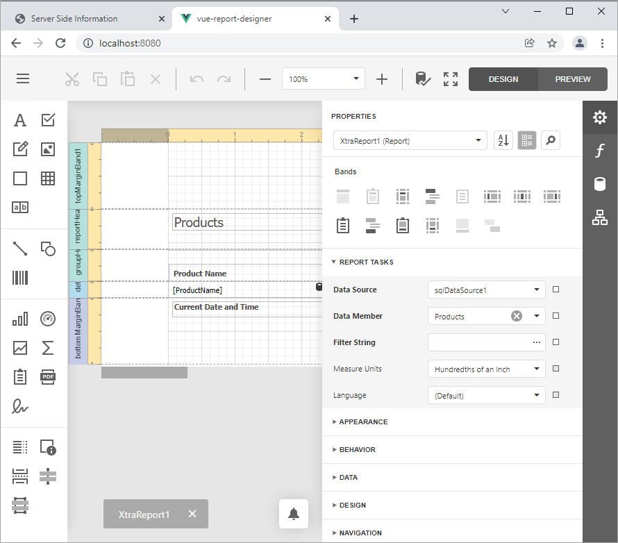

<!-- default badges list -->

[](https://supportcenter.devexpress.com/ticket/details/T848270)
[](https://docs.devexpress.com/GeneralInformation/403183)
[](#does-this-example-address-your-development-requirementsobjectives)
<!-- default badges end -->
# How to use the End-User Web Report Designer in JavaScript with Vue Framework

This example consists of two parts: 

- A server (back-end) ASP.NET MVC project that enables [cross-domain requests (CORS)](https://developer.mozilla.org/en-US/docs/Web/HTTP/CORS) (Access-Control-Allow-Origin) and implements a custom web report storage.

- An <a href="https://vuejs.org/">Vue JavaScript Framework</a> front-end client application.

Perform the following steps to run this example:

1. Open the back-end project solution (**CS\ServerSide.sln** or **VB\ServerSide.sln**) in Visual Studio and run the project.
2. Navigate to the **JS\vue-report-designer** folder that is the client part's root folder.
3. Open the console and run the following command:

    ```npm install```

4. Run the command to compile and start the client part:

    ```npm run serve```

5. Point your browser at [http://localhost:8080/](http://localhost:8080/) to see the result.



For a step-by-step tutorial, refer to the
[Report Designer Integration in Vue](https://docs.devexpress.com/XtraReports/401542) topic.
<!-- feedback -->
## Does this example address your development requirements/objectives?

[](https://www.devexpress.com/support/examples/survey.xml?utm_source=github&utm_campaign=reporting-vue-integrate-end-user-designer&~~~was_helpful=yes) [](https://www.devexpress.com/support/examples/survey.xml?utm_source=github&utm_campaign=reporting-vue-integrate-end-user-designer&~~~was_helpful=no)

(you will be redirected to DevExpress.com to submit your response)
<!-- feedback end -->
