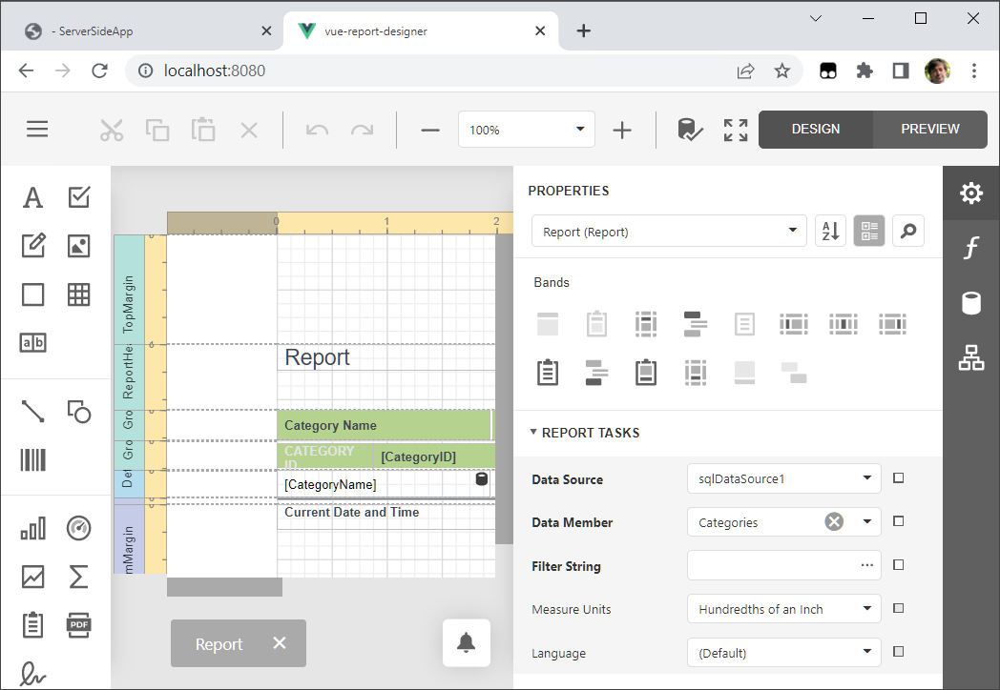

# How to use the End-User Web Report Designer in JavaScript with Vue Framework

This example consists of two parts:

- A server (back-end) ASP.NET Core project that enables [cross-domain requests (CORS)](https://developer.mozilla.org/en-US/docs/Web/HTTP/CORS) (Access-Control-Allow-Origin) and implements a custom web report storage.

- A <a href="https://vuejs.org/">Vue JavaScript Framework</a> front-end client application.

Perform the following steps to run this example:

1. Open the back-end project solution (**CS/ServerSide.sln**) in Visual Studio and run the project.
2. Navigate to the **JS/vue-report-designer** folder that is the client part's root folder.
3. Open the console and run the following command:

    ```npm install```

4. Run the command to compile and start the client part:

    ```npm run serve```

5. Point your browser at `http://localhost:8080/` to see the result.

    


## Files to Review 

- [ReportDesignerComponent.vue](JS/vue-report-designer/src/components/ReportDesignerComponent.vue)
- [main.js](JS/vue-report-designer/src/main.js)
- [ReportingControllers.cs](CS/ServerSideApp/Controllers/ReportingControllers.cs)
- [CustomReportStorageWebExtension.cs](CS/ServerSideApp/Services/CustomReportStorageWebExtension.cs)
- [Startup.cs](CS/ServerSideApp/Startup.cs)

## Documentation

- [Report Designer Integration in Vue](https://docs.devexpress.com/XtraReports/401542)
## More Examples

- [How to use the Web Document Viewer in JavaScript with the Vue JavaScript Framework](https://github.com/DevExpress-Examples/reporting-web-document-viewer-in-javascript-with-vue)

